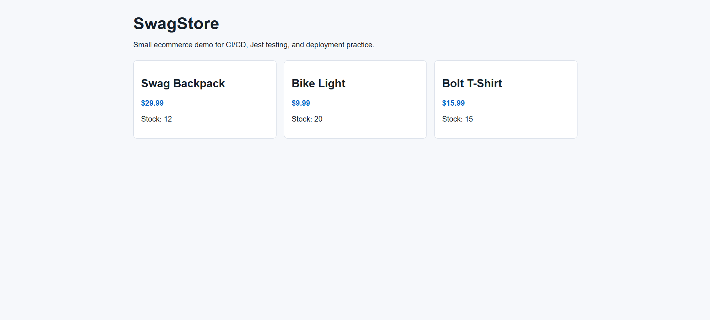
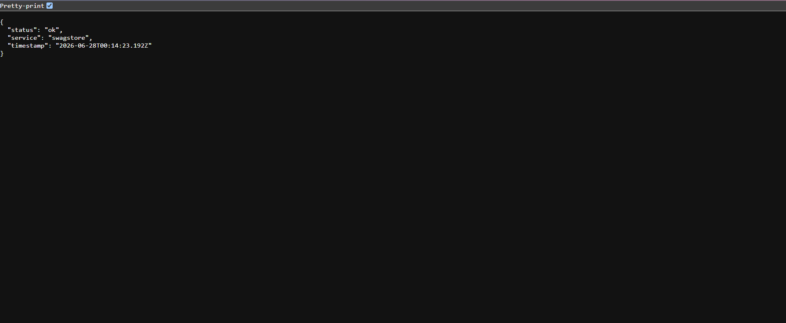

# Submission Evidence

GitHub repository:

```text
https://github.com/thanhtung2415/testing-personal-project
```

GitHub Actions:

```text
https://github.com/thanhtung2415/testing-personal-project/actions
```

## Successful Workflow Runs

| Assignment | Workflow | Result | Run URL |
| --- | --- | --- | --- |
| BlackBox Testing | BlackBox Docs Check | Success | https://github.com/thanhtung2415/testing-personal-project/actions/runs/28297173344 |
| WhiteBox Testing | WhiteBox Jest Tests | Success | https://github.com/thanhtung2415/testing-personal-project/actions/runs/28297190892 |
| SwagStore CI/CD | SwagStore CI/CD | Success | https://github.com/thanhtung2415/testing-personal-project/actions/runs/28297206056 |
| API Testing | Restful-Booker API Tests | Success | https://github.com/thanhtung2415/testing-personal-project/actions/runs/28297221621 |
| UI Automation Testing | OrangeHRM UI Automation | Success | https://github.com/thanhtung2415/testing-personal-project/actions/runs/28297236205 |
| Performance Testing | JMeter Performance Tests | Success | https://github.com/thanhtung2415/testing-personal-project/actions/runs/28298996720 |

## Commit Timeline

| Commit | Assignment | Message |
| --- | --- | --- |
| `157b91a` | BlackBox + structure | Initialize repository with blackbox testing assignment |
| `c5ef7e9` | WhiteBox | Add whitebox testing with Jest coverage |
| `6eff3a9` | SwagStore CI/CD | Add SwagStore CI CD with Jest tests |
| `209524d` | API Testing | Add Restful Booker API tests with Newman |
| `78fcbf2` | UI Automation | Add OrangeHRM UI automation tests |
| `acb55c7` | Performance Testing | Add JMeter performance testing assignment |

## Deployment

Render deployment:

```text
https://swagstore-testing-demo.onrender.com
```

Render health check:

```text
https://swagstore-testing-demo.onrender.com/api/health
```

The health check endpoint returns `status: ok` and `service: swagstore`.

## Deployment Screenshots

SwagStore live site:



Health check endpoint:


